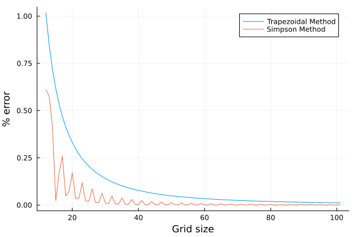
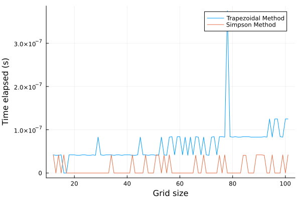

# Simpson.jl

This package uses composite Simpson's rule to perform one dimensional numerical integration of $y(x)$ for a given array x.

## Example

```julia
using Simpson

x = collect(range(0, 9, length=101))
y = map(t -> (cos(t))^2, x)

println(simpson(y, x))
```

```plaintext
= 4.312252089129921
```

Using the Quadgk package, we can compare this with the output of integration using adaptive Gauss-Kronrod Quadrature method and also the how fast the Simpson rule is,

```julia
using Quadgk

println(quadgk(t -> (cos(t))^2, 0, 9, rtol=1e-6)[1])
```

```julia
= 4.312253188307081
```

## Comparison with Trapezoidal rule

```julia
using Trapz
using Simpson
using BenchmarkTools

x = collect(range(0, 9, length=101))
y = map(t -> (cos(t))^2, x)

@btime simpson($y, $x)
@btime trapz($x, $y)
```

```plaintext
51.039 ns (0 allocations: 0 bytes)
89.118 ns (1 allocation: 64 bytes)
```

The plots below show the accuracy and the time elapsed of Simpson's and Trapeziodal rules with increasing number of grid





However, currently this package doesn't have the multidimensional integration capabilities. Though one can use following method,

```julia
using Simpson

x1 = collect(range(0, 9, length=101))
y1 = collect(range(0, 9, length=101))

z1 = [sqrt(x^2 + y^2) for x in x1, y in y1]

simpson([simpson(z1[x, :], y1) for x in eachindex(x1)], x1)
```

```plaintext
= 557.8276989886084
```
